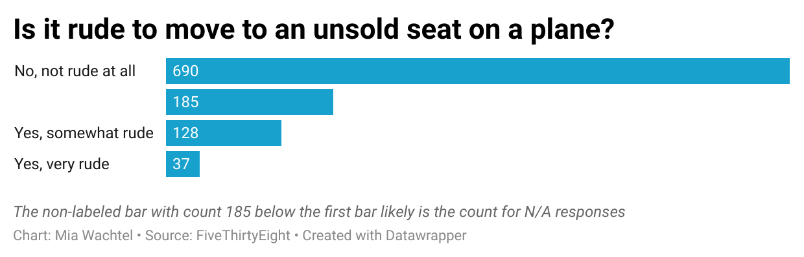

# Data-Visualizations-J124
### Week 4 Data Visualization Assignment

**Question: "Is it rude to move to an unsold seat on a plane?"**

As someone who will opt to move to an empty row or window seat on an airplane, I was naturally drawn to this particular question. I personally don't think it's rude, but I was curious to see how others answered. Unsurprisingly, **most people thought it was not rude** — lucky for me! I was surprised to see that a whopping **128 people believed it was rude**, especially given that moving to an unsold seat doesn't affect personally them. But, everyone reserves the right to their own opinion, I suppose. 

My bar chart allows viewers to easily digest the visual rankings since I opted to make it a horizontal bar chart. The first (and longest) bar reveals that **690 people don't believe it is rude** to sit in an unsold plane seat. The following bar has no title associated with it, though I assume and have included in the description that this bar likely reveals that **185 opted not to answer the question.** Finally, the last two bars reveal different levels of dissatisfaction with people sitting in unsold plane seats. **128 people found it somewhat rude**, while the smallest bar reveals that **37 people found it very rude**

